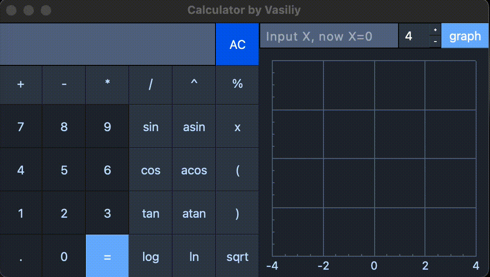

# Calculator
Описание на русском [тут](./README_RUS.md). 

School 21 project. Functions for calculations are written in C++ language. The QT library (C++) is responsible for the visual part.

1. [MVC Model](#mvc-model)
2. [Frontend](#frontend)
3. [Backend](#backend)
4. [Installation and testing](#installation-and-testing)
5. [Technical assignment](#technical-assignment)

## MVC Model

***Model-View-Controller*** means dividing a program into components.

*Model* - is responsible for checking and working with data. The model has no visualization.

*VIew* - Presents the result of the model to the user.

*Controller* - The link between the view and the model. Passes requests from the user to the model, returns the result of the request.

This separation allows you to easily replace the model of one type with another (for example, in another programming language) or connect another visualization. It is also possible to connect several user interfaces to one logical part. 

## Frontend
### Mathematical operations

Use the buttons to compose a mathematical expression that will be sent by the controller to the calculation function when you press ` = `

### Plotting

In the `X` input box, you can enter any number to substitute into the formula.
The graph will be centered on the given X and the Y obtained from it.
You can change the scale of the graph if necessary.

## Backend

1. The controller passes a string with a mathematical expression to the model.
1. The string entered by the user is checked for correctness.
2. Conversion from the infix entry (`3 + 3`) to the inverse Polish entry (`3 3 +`) is performed using the algorithm "sorting station". 
3. Using the algorithm of calculation by the inverse Polish notation - we get the result of the entered expression.
4. Return the result of the calculation to the controller. 
  
## Installation and testing
### Building an application

Assembly is performed using Makefile with the following purposes:

`install` - install the application in the directory above.

`uninstall` - remove the application from the directory above.

`dvi` - open the documentation. 

### Testing

Functions for calculations are covered by unit tests.

`test` - run tests of the functions.

`leaks` - check the code under test for leaks.

`gcov_report` - see code coverage by tests.

## Technical assignment

- The program must be developed in C++ language of C++17 standard;
- The program code must be located in the src folder;
- When writing code it is necessary to follow the Google style;
- Classes must be implemented within the `s21` namespace;
- Prepare full coverage of expression calculation modules with unit-tests using the GTest library;
- The program must be built with Makefile which contains standard set of targets for GNU-programs: all, install, uninstall, clean, dvi, dist, tests. Installation directory could be arbitrary;
- GUI implementation, based on any GUI library with API for C++17:
  * For Linux: GTK+, CEF, Qt, JUCE;
  * For Mac: GTK+, CEF, Qt, JUCE, SFML, Nanogui, Nngui;
- The program must be implemented using the MVC pattern, and also:
   - there should be no business logic code in the view code;
   - there should be no interface code in the controller and the model;
   - controllers must be thin;
- Both integers and real numbers with a dot can be input into the program. You should provide the input of numbers in exponential notation;
- The calculation must be done after you complete entering the calculating expression and press the `=` symbol;
- Calculating arbitrary bracketed arithmetic expressions in infix notation;
- Calculate arbitrary bracketed arithmetic expressions in infix notation with substitution of the value of the variable _x_ as a number;
- Plotting a graph of a function given by an expression in infix notation with the variable _x_ (with coordinate axes, mark of the used scale and an adaptive grid);
   - It is not necessary to provide the user with the ability to change the scale;
- Domain and codomain of a function are limited to at least numbers from -1000000 to 1000000;
   - To plot a graph of a function it is necessary to additionally specify the displayed domain and codomain;
- Verifiable accuracy of the fractional part is at least to 7 decimal places;
- Users must be able to enter up to 255 characters;
- Bracketed arithmetic expressions in infix notation must support the following arithmetic operations and mathematical functions:
- **Arithmetic operators**:
   | Operator name | Infix notation   (Classic) | Prefix notation   (Polish notation) |  Postfix notation   (Reverse Polish notation) |
   | --------- | ------ | ------ | ------ |
   | Brackets | (a + b) | (+ a b) | a b + |
   | Addition | a + b | + a b | a b + |
   | Subtraction | a - b | - a b | a b - |
   | Multiplication | a * b | * a b | a b * |
   | Division | a / b | / a b | a b \ |
   | Power | a ^ b | ^ a b | a b ^ |
   | Modulus | a mod b | mod a b | a b mod |
   | Unary plus | +a | +a | a+ |
   | Unary minus | -a | -a | a- |
   >Note that the multiplication operator contains the obligatory sign `*`. Processing an expression with the omitted `*` sign is optional and is left to the developer's decision.
- **Functions**:
   | Function description | Function |
   | ------ | ------ |
   | Computes cosine | cos(x) |
   | Computes sine | sin(x) |
   | Computes tangent | tan(x) |
   | Computes arc cosine | acos(x) |
   | Computes arc sine | asin(x) |
   | Computes arc tangent | atan(x) |
   | Computes square root | sqrt(x) |
   | Computes natural logarithm | ln(x) |
   | Computes common logarithm | log(x) |
