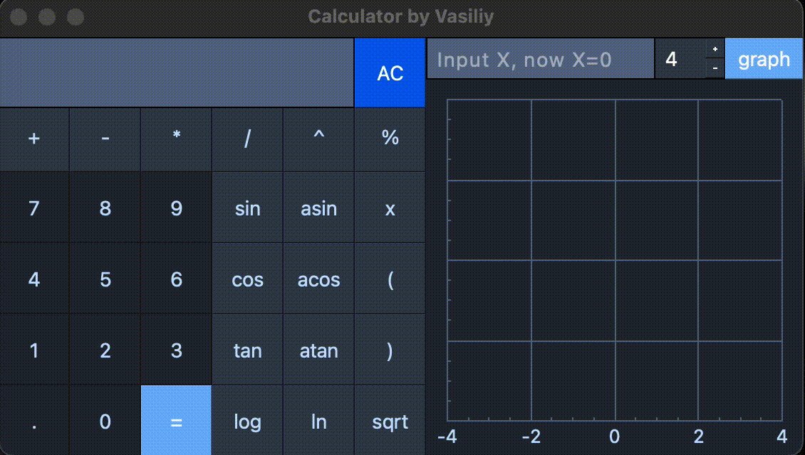
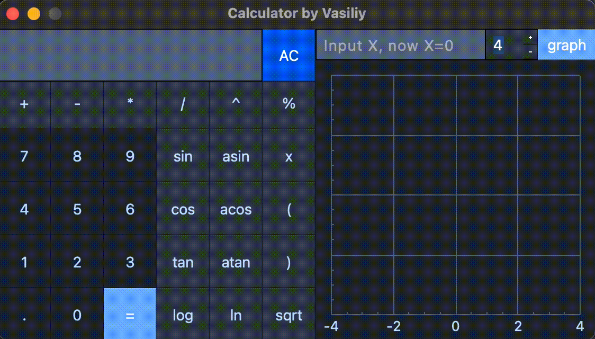

# Калькулятор C++
English readme [here](./README.md).

Проект школы 21. Функции для вычислений на писаны на языке С++. За визуальную часть отвечает библиотека QT (С++).

1. [MVC Модель](#mvc-модель)
2. [Визуальная часть](#визуальная-часть)
3. [Под капотом](#под-капотом)
4. [Сборка и тестирование](#сборка-и-тестирование)
5. [Техническое задание](#техническое-задание)

## MVC Модель

***Model-View-Controller*** («Модель-Вид-Контроллер») подразумевает разделение программы на компоненты.

*Model* - отвечает за проверку и работу с данным. Модель не имеет визуализации.

*VIew* - Представляет пользователю результат работы модели.

*Controller* - Связывающее звено между видом и моделью. Передает запросы от пользователя в модель, возвращает результат запроса.

Такое разделение позволяет легко заменить модель одного типа на другой (например на другом языке программирования) или подключить другую визуализацию. Также можно подключить несколько пользовательских интерфейсов к одной логической части. 

## Визуальная часть
### Математические операции

С помощью кнопок составляем математическое выражение, которое будет отправлено контроллером в вычислительную функцию при нажатии на ` = `

### Построение графиков

В поле ввода `X` можно ввести любое число для подстановки в формулу.
График будет центрироваться по заданному X и полученному от него Y.
Можно изменить масштаб графика при необходимости.

## Под капотом

1. Контроллер передает строку с математическим выражением в модель.
1. Введенная пользователем строка проверяется на корректность.
2. Производится преобразование из инфиксной записи (`3 + 3`) в обратную польскую запись (`3 3 +`) используя алгоритм "сортировочная станция". 
3. Используя алгоритм вычисления по обратной польской записи - получаем результат введенного выражения.
4. Возвращаем результат вычисления на контроллер. 
  

## Сборка и тестирование
### Установка приложения

Сборка осуществляется с помощью Makefile следующими целями:

`install` - установить приложение в директорию выше.

`uninstall` - удалить приложение из директории выше.

`dvi` - открыть документацию. 

### Тестирование

Функции для вычислений покрыты unit-тестами.

`test` - запустить тесты функций.

`leaks` - проверить тестируемый код на утечки.

`gcov_report` - посмотреть покрытие тестами кода.

## Техническое задание

- Программа должна быть разработана на языке C++ стандарта C++17;
- Код программы должен находиться в папке src;
- При написании кода необходимо придерживаться Google Style;
- Классы должны быть реализованы внутри пространства имен `s21`;
- Необходимо подготовить полное покрытие unit-тестами модулей, связанных с вычислением выражений, c помощью библиотеки GTest;
- Сборка программы должна быть настроена с помощью Makefile со стандартным набором целей для GNU-программ: all, install, uninstall, clean, dvi, dist, tests. Установка должна вестись в любой другой произвольный каталог;
- Реализация с графическим пользовательским интерфейсом, на базе любой GUI-библиотеки с API для C++17: 
  * Для Linux: GTK+, CEF, Qt, JUCE;
  * Для Mac: GTK+, CEF, Qt, JUCE, SFML, Nanogui, Nngui;
- Программа должна быть реализована с использованием паттерна MVC, а также:
    - не должно быть кода бизнес-логики в коде представлений;
    - не должно быть кода интерфейса в контроллере и в модели;
    - контроллеры должны быть тонкими;
- На вход программы могут подаваться как целые числа, так и вещественные числа, записанные и через точку, и в экспоненциальной форме записи;
- Вычисление должно производиться после полного ввода вычисляемого выражения и нажатия на символ `=`;
- Вычисление произвольных скобочных арифметических выражений в инфиксной нотации;
- Вычисление произвольных скобочных арифметических выражений в инфиксной нотации с подстановкой значения переменной _x_ в виде числа;
- Построение графика функции, заданной с помощью выражения в инфиксной нотации с переменной _x_  (с координатными осями, отметкой используемого масштаба и сеткой с адаптивным шагом);
    - Не требуется предоставлять пользователю возможность менять масштаб;
- Область определения и область значения функций ограничиваются по крайней мере числами от -1000000 до 1000000;
    - Для построения графиков функции необходимо дополнительно указывать отображаемые область определения и область значения;
- Проверяемая точность дробной части - минимум 7 знаков после запятой;
- У пользователя должна быть возможность ввода до 255 символов;
- Скобочные арифметические выражения в инфиксной нотации должны поддерживать следующие арифметические операции и математические функции:
- **Арифметические операторы**:

    | Название оператора | Инфиксная нотация   (Классическая) | Префиксная нотация   (Польская нотация) |  Постфиксная нотация   (Обратная польская нотация) |
    | ------ | ------ | ------ | ------ |
    | Скобки | (a + b) | (+ a b) | a b + |
    | Сложение | a + b | + a b | a b + |
    | Вычитание | a - b | - a b | a b - |
    | Умножение | a * b | * a b | a b * |
    | Деление | a / b | / a b | a b \ |
    | Возведение в степень | a ^ b | ^ a b | a b ^ |
    | Остаток от деления | a mod b | mod a b | a b mod |
    | Унарный плюс | +a | +a | a+ |
    | Унарный минус | -a | -a | a- |

    >Обрати внимание, что оператор умножения содержит обязательный знак `*`. Обработка выражения с опущенным знаком `*` является необязательной и остается на усмотрение разработчика.

- **Функции**:

    | Описание функции | Функция |   
    | ---------------- | ------- |  
    | Вычисляет косинус | cos(x) |   
    | Вычисляет синус | sin(x) |  
    | Вычисляет тангенс | tan(x) |  
    | Вычисляет арккосинус | acos(x) | 
    | Вычисляет арксинус | asin(x) | 
    | Вычисляет арктангенс | atan(x) |
    | Вычисляет квадратный корень | sqrt(x) |
    | Вычисляет натуральный логарифм | ln(x) | 
    | Вычисляет десятичный логарифм | log(x) |
